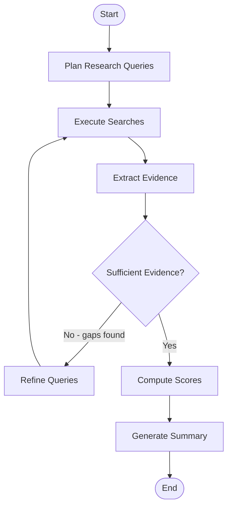
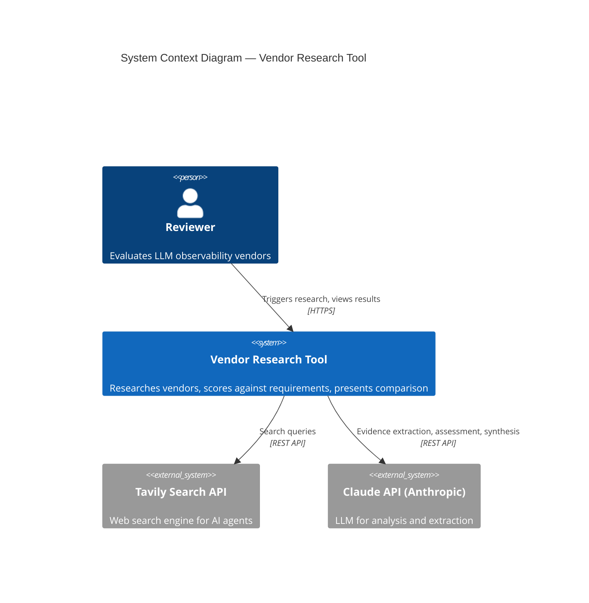
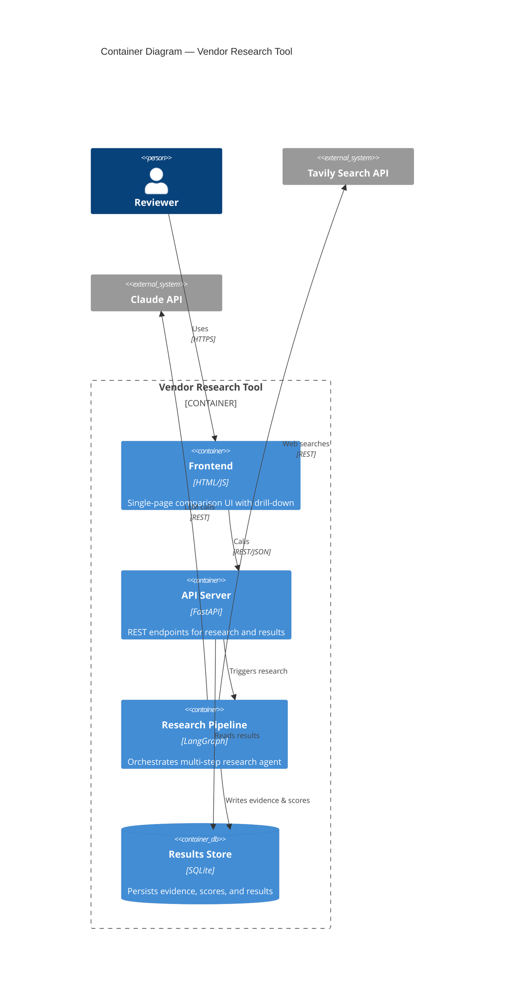
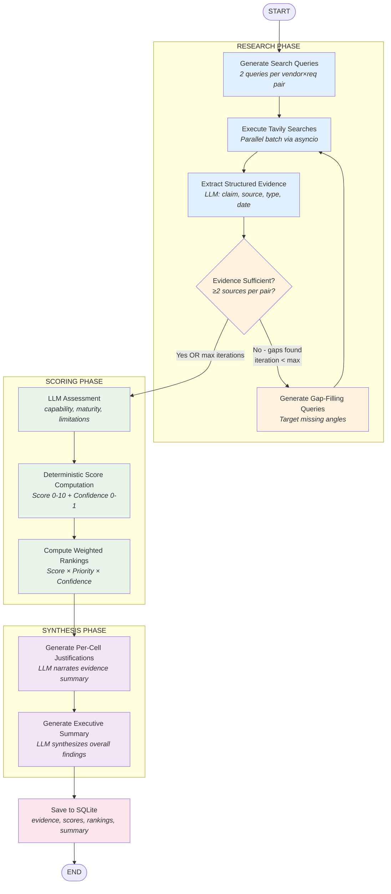
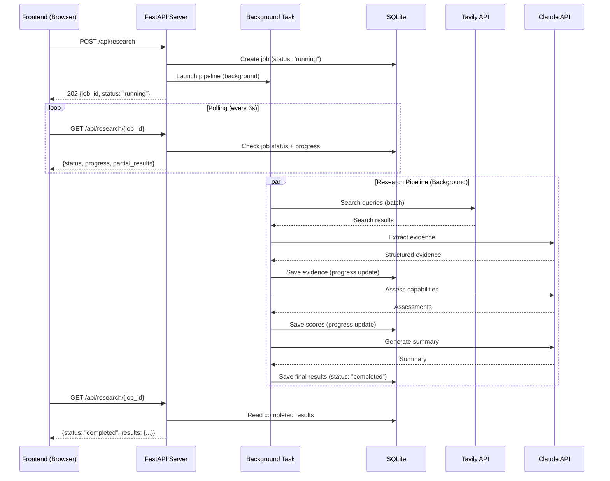

# SignalCore Plan — Refinement & Deep Dive

## Q1: Search API Selection — Why Tavily?

### Decision Rationale

| Criterion | Tavily | Exa | SerpAPI |
|-----------|--------|-----|---------|
| **Purpose-built for AI** | Yes — designed for LLM agents | Yes — semantic search for AI | No — raw SERP scraper |
| **LangChain integration** | Native (`TavilySearchResults`) | Community tool | Community tool |
| **Result quality** | NLP-summarized snippets, relevance scores | Semantic similarity search | Raw Google results (noisy) |
| **Source metadata** | URL, title, content, score | URL, title, text | URL, title, snippet |
| **Time filtering** | `time_range` param (day/week/month/year) | Date filters | `tbs` param (complex) |
| **Domain filtering** | `include_domains` / `exclude_domains` | Domain filtering | Site operator |
| **Pricing (prototype)** | 1,000 free credits/month | 1,000 free searches/month | 100 free searches/month |
| **Latency** | ~1-2s per search | ~1-2s | ~2-3s |
| **Setup complexity** | API key only | API key only | API key + parsing logic |

**Why Tavily wins for this prototype:**

1. **Lowest friction with LangChain/LangGraph.** Tavily has a first-party LangChain integration (`TavilySearchResults` tool). This saves 15-20 minutes of boilerplate compared to Exa or SerpAPI, which require custom tool wrappers. In a 3-hour build, that matters.

2. **Pre-processed content.** Tavily returns NLP-summarized snippets (not raw HTML), which means our evidence extraction LLM prompt gets cleaner input. SerpAPI returns raw Google snippets that often need additional processing. Exa returns full text, which is richer but requires more token budget for extraction.

3. **Relevance scoring built-in.** Each Tavily result includes a `score` (0-1) that we can use as a signal in our confidence calculation. Exa has similarity scores too, but SerpAPI has nothing.

4. **Time filtering is trivial.** `time_range: "month"` vs. building date-range queries manually. For evidence recency — a core assignment requirement — this is valuable.

**Why NOT the others (for now):**

- **Exa** is excellent for semantic search ("find pages similar to X") but our use case is better served by keyword-targeted queries like "Langfuse OpenTelemetry support". Exa shines when you don't know what you're looking for; we know exactly what we're looking for per requirement.

- **SerpAPI** gives raw Google results, which are comprehensive but noisy. We'd need additional parsing and cleaning. Good for production (broadest coverage), but too much overhead for a prototype.

- **Multi-provider approach** (use all three) is the ideal production architecture — each provider has blind spots. But it triples API complexity, error handling, and result deduplication. Document this as a "what we'd do at scale" point for the Zoom.

**Scale recommendation (Zoom talking point):** At production scale, use a **search aggregator pattern** — fan out to Tavily + Exa + direct documentation scraping, deduplicate by URL, merge evidence. This increases coverage and reduces single-provider risk.

---

## Q1.2: Can LangGraph Simulate Deep Research?

**Yes, absolutely.** This is one of LangGraph's core strengths — it enables iterative, stateful agent loops that are essentially "deep research" processes.

### How Deep Research Works (Conceptually)

Traditional search: `query → results → done`

Deep research: `query → results → analyze gaps → refine query → more results → synthesize → check completeness → repeat or finish`

### LangGraph Implementation Pattern



The key difference from a simple chain is the **conditional loop**: after extracting evidence, we evaluate whether we have enough. If not, we generate refined queries targeting the gaps and search again. LangGraph's `conditional_edges` make this natural:

```python
# Pseudo-code for the conditional routing
def should_continue_research(state: ResearchState) -> str:
    """Decide whether to do another research iteration."""
    evidence = state["evidence"]
    current_iteration = state["iteration"]
    max_iterations = 2  # Cap to prevent infinite loops
    
    if current_iteration >= max_iterations:
        return "score"  # Move to scoring even if gaps remain
    
    # Check for vendor×requirement pairs with insufficient evidence
    gaps = find_evidence_gaps(evidence, min_sources=2)
    
    if len(gaps) == 0:
        return "score"  # All pairs have sufficient evidence
    else:
        state["research_gaps"] = gaps
        return "refine_and_search"  # Loop back for more research
```

### Why Not Use Tavily's `/research` Endpoint Instead?

Looking at the Tavily Research API docs, it performs comprehensive research and returns a full report. However:

| Factor | LangGraph + `/search` | Tavily `/research` |
|--------|----------------------|-------------------|
| **Control** | Full — we design the loop, queries, extraction | Black box — Tavily decides what to research |
| **Structure** | We get per-vendor×requirement evidence | We get a monolithic report to decompose |
| **Granularity** | Evidence linked to specific requirements | General report, must map back to requirements |
| **Cost predictability** | 1 credit per search, we control count | Unknown credits per research task |
| **Latency** | Parallel searches, ~10-15s total | Async, could take 30-60s+ |
| **Demonstrates skill** | Shows agent architecture thinking | Shows API integration |

**Decision: Use `/search` (sync) with LangGraph orchestration.**

The `/research` endpoint is a pre-built agent that does what we're building ourselves. Using it would be like submitting a homework solution that says "I used WolframAlpha." The whole point of this assignment is to demonstrate that we can architect the research pipeline ourselves.

Additionally, `/research` returns a prose report that we'd then need to parse back into structured evidence per vendor×requirement. That's backwards — we'd be decomposing what was composed, losing fidelity at each step.

**However**, `/research` could be valuable in production as a **supplementary enrichment step** — run it once per vendor to get a holistic overview, then merge with our structured per-requirement evidence. Document this as a future enhancement.

### MVP Deep Research: Practical Implementation

For our 3-hour prototype, we implement a **controlled 2-iteration loop**:

**Iteration 1 — Broad sweep:** 2 search queries per vendor×requirement pair (4 vendors × 6 requirements = 24 pairs × 2 queries = 48 searches).

**Iteration 2 — Gap filling:** For any pair with < 2 evidence items or confidence < 0.5, generate 1 refined query targeting the gap (estimated 5-10 additional searches).

Total: ~55-60 Tavily API calls. At 1 credit each, well within the free tier (1,000/month).

---

## Q1.2.1: Why 2-3 Searches Per Vendor×Requirement?

### The Rationale

**Why more than 1:** A single search query captures one angle. Requirements are multi-faceted. For example, "Framework-agnostic tracing" could mean:
- Query 1: `"Langfuse framework agnostic tracing SDK"` → finds official docs about their SDK
- Query 2: `"Langfuse non-LangChain integration examples"` → finds community usage patterns

Different queries surface different source types (official docs vs. community vs. comparisons), which is essential for our confidence scoring.

**Why not 5-10:** Diminishing returns. In testing search APIs, queries 1-2 capture ~80% of relevant evidence. Queries 3-5 mostly return the same URLs with slightly different snippets. More queries = more latency + more cost with marginal evidence gain.

**Why 2 in iteration 1, and 1 more in iteration 2 if needed:** This is the deep research pattern. Cast a net, assess what you caught, then cast again only where you came up empty. This is more efficient than blindly doing 3 searches for every pair regardless of evidence density.

### Evidence Density Analysis (Expected)

| Vendor | Expected Evidence Density | Rationale |
|--------|--------------------------|-----------|
| LangSmith | High | Extensive docs, large community, many comparisons |
| Langfuse | High | Open-source, great docs, active GitHub |
| Braintrust | Medium | Smaller community, decent docs |
| PostHog | Medium-Low | LLM observability is a newer feature, less dedicated coverage |

This means our gap-filling iteration will likely focus more on PostHog and Braintrust, which is correct behavior — we spend research effort where evidence is sparse.

---

## Q1.2.2: Handling Sparse Evidence

Sparse evidence is handled at **three levels**, not just confidence scoring:

### Level 1: Research Phase — Try Harder

When iteration 1 yields sparse evidence for a pair, the gap-filling iteration generates queries from a different angle:

```python
def generate_gap_filling_query(vendor: str, requirement: str, existing_evidence: list) -> str:
    """Generate a refined query when initial searches came up empty."""
    # If direct feature search failed, try:
    # 1. Comparison queries: "Langfuse vs LangSmith [requirement]"
    # 2. GitHub queries: "Langfuse [requirement] site:github.com"
    # 3. Community queries: "Langfuse [requirement] review experience"
    # 4. Changelog/release queries: "Langfuse [requirement] release announcement"
```

### Level 2: Scoring Phase — Confidence Penalty

The confidence score naturally drops when evidence is sparse (fewer sources, possibly lower authority). This propagates to the weighted overall score.

### Level 3: UI Phase — Visual Transparency

Low-confidence cells get visual treatment:
- Dashed border instead of solid
- Muted color opacity
- Tooltip: "Limited public evidence found — score based on [N] sources"
- The evidence panel shows what was found AND what was searched for (so the user can see we tried)

This three-level approach is more honest than alternatives:
- ❌ Assigning 0 (penalizes vendors with bad SEO, not bad products)
- ❌ Guessing a middle score (false precision)
- ✅ Giving our best assessment + being transparent about its reliability

---

## Q2: Detailed Scoring Methodology

### Layer 1: Per-Requirement Score (0-10) — Hybrid Approach

#### Step 1: LLM Assessment (Structured Output)

The LLM reads the collected evidence for a vendor×requirement pair and produces a structured assessment:

```python
class LLMAssessment(BaseModel):
    """What the LLM produces from reading evidence."""
    capability_level: str        # "full" | "partial" | "minimal" | "none" | "unknown"
    capability_details: str      # Brief explanation of what the vendor offers
    maturity: str                # "ga" | "beta" | "experimental" | "planned" | "unknown"
    limitations: list[str]       # Known caveats or restrictions
    supports_requirement: bool   # Overall: does this vendor meet the requirement?
```

##### Prompt for LLM Assessment:

```
You are evaluating whether vendor "{vendor}" meets a specific requirement
for an LLM observability platform.

REQUIREMENT: {requirement_text}
PRIORITY: {priority}

EVIDENCE COLLECTED:
{formatted_evidence_with_sources}

Based ONLY on the evidence provided above, assess this vendor's capability.
Do NOT use prior knowledge — only what the evidence shows.

Respond with a structured assessment:
- capability_level: How well does the vendor support this requirement?
  - "full": Native, well-documented support with clear examples
  - "partial": Some support but with gaps, workarounds, or limitations
  - "minimal": Basic or indirect support only
  - "none": Evidence explicitly shows this is not supported
  - "unknown": Evidence is insufficient to determine

- capability_details: In 1-2 sentences, what specifically does the vendor
  offer for this requirement? Cite source URLs.

- maturity: What is the maturity of this feature?
  - "ga": Generally available, production-ready
  - "beta": Available but marked as beta or preview
  - "experimental": Early stage, may change
  - "planned": On roadmap but not yet available
  - "unknown": Cannot determine from evidence

- limitations: List any caveats, restrictions, or known issues.
  Empty list if none found.

- supports_requirement: Overall boolean — does this vendor meaningfully
  meet this requirement based on the evidence?

Be conservative. If evidence is ambiguous, lean toward "partial" or "unknown"
rather than "full".
```

#### Step 2: Deterministic Score Computation

```python
def compute_requirement_score(
    assessment: LLMAssessment,
    evidence_items: list[Evidence]
) -> float:
    """
    Compute a 0-10 score from LLM assessment + evidence attributes.
    This is DETERMINISTIC — same inputs always produce same output.
    """
    
    # --- Component 1: Capability Coverage (40% weight) ---
    CAPABILITY_SCORES = {
        "full": 10.0,
        "partial": 6.0,
        "minimal": 3.0,
        "none": 0.0,
        "unknown": 3.0  # Benefit of doubt, but low
    }
    capability_score = CAPABILITY_SCORES[assessment.capability_level]
    
    # --- Component 2: Evidence Strength (30% weight) ---
    # Based on number and quality of evidence items
    source_count = len(evidence_items)
    supporting_count = sum(1 for e in evidence_items if e.supports_requirement)
    
    if source_count == 0:
        evidence_score = 0.0
    else:
        # More sources = higher score, with diminishing returns
        count_factor = min(source_count / 4.0, 1.0)  # Cap at 4 sources
        
        # Higher proportion of supporting evidence = higher score
        support_ratio = supporting_count / source_count
        
        # Source authority bonus
        authority_weights = {
            "official_docs": 1.0,
            "github": 0.85,
            "comparison": 0.7,
            "blog": 0.5,
            "community": 0.4
        }
        avg_authority = sum(
            authority_weights.get(e.source_type, 0.5) for e in evidence_items
        ) / source_count
        
        evidence_score = (count_factor * 0.4 + support_ratio * 0.4 + avg_authority * 0.2) * 10
    
    # --- Component 3: Maturity (20% weight) ---
    MATURITY_SCORES = {
        "ga": 10.0,
        "beta": 6.0,
        "experimental": 3.0,
        "planned": 1.0,
        "unknown": 4.0
    }
    maturity_score = MATURITY_SCORES[assessment.maturity]
    
    # --- Component 4: Limitations Penalty (10% weight) ---
    # More limitations = lower score
    limitation_count = len(assessment.limitations)
    limitations_score = max(0, 10.0 - (limitation_count * 2.5))
    # 0 limitations = 10, 1 = 7.5, 2 = 5, 3 = 2.5, 4+ = 0
    
    # --- Weighted combination ---
    final_score = (
        capability_score * 0.40 +
        evidence_score   * 0.30 +
        maturity_score   * 0.20 +
        limitations_score * 0.10
    )
    
    return round(final_score, 1)
```

### Layer 2: Confidence Score (0-1) — Fully Deterministic

No LLM involvement here. Pure computation from evidence metadata.

```python
def compute_confidence(evidence_items: list[Evidence]) -> float:
    """
    Compute confidence in our assessment. 0 = no confidence, 1 = high confidence.
    Fully deterministic — no LLM involved.
    """
    
    if len(evidence_items) == 0:
        return 0.0
    
    # --- Factor 1: Source Count (30% weight) ---
    # 1 source = 0.25, 2 = 0.5, 3 = 0.75, 4+ = 1.0
    count_score = min(len(evidence_items) / 4.0, 1.0)
    
    # --- Factor 2: Source Authority (30% weight) ---
    AUTHORITY_MAP = {
        "official_docs": 1.0,    # Vendor's own documentation
        "github": 0.85,          # Code/issues/discussions
        "comparison": 0.7,       # Third-party comparison sites
        "blog": 0.5,             # Blog posts, tutorials
        "community": 0.4         # Forum posts, Reddit, etc.
    }
    authority_score = sum(
        AUTHORITY_MAP.get(e.source_type, 0.5) for e in evidence_items
    ) / len(evidence_items)
    
    # --- Factor 3: Source Recency (25% weight) ---
    from datetime import datetime, timedelta
    now = datetime.now()
    recency_scores = []
    for e in evidence_items:
        if e.content_date:
            try:
                pub_date = datetime.fromisoformat(e.content_date)
                age_days = (now - pub_date).days
                if age_days <= 90:      # Last 3 months
                    recency_scores.append(1.0)
                elif age_days <= 180:    # Last 6 months
                    recency_scores.append(0.8)
                elif age_days <= 365:    # Last year
                    recency_scores.append(0.5)
                else:                    # Older than 1 year
                    recency_scores.append(0.2)
            except ValueError:
                recency_scores.append(0.5)  # Can't parse date
        else:
            recency_scores.append(0.4)  # No date available
    
    recency_score = sum(recency_scores) / len(recency_scores) if recency_scores else 0.4
    
    # --- Factor 4: Consistency (15% weight) ---
    # Do sources agree on whether the requirement is supported?
    if len(evidence_items) < 2:
        consistency_score = 0.5  # Can't assess consistency with 1 source
    else:
        supporting = sum(1 for e in evidence_items if e.supports_requirement)
        total = len(evidence_items)
        # If all agree (all support or all refute), consistency = 1.0
        # If split 50/50, consistency = 0.0
        agreement_ratio = max(supporting, total - supporting) / total
        consistency_score = agreement_ratio
    
    # --- Weighted combination ---
    confidence = (
        count_score      * 0.30 +
        authority_score  * 0.30 +
        recency_score    * 0.25 +
        consistency_score * 0.15
    )
    
    return round(confidence, 2)
```

### Layer 3: Weighted Overall Score — Fully Deterministic

```python
def compute_overall_rankings(
    scores: dict,           # {vendor: {req_id: ScoreResult}}
    requirements: list[dict] # [{id, text, priority, weight}]
) -> list[dict]:
    """
    Compute weighted overall score per vendor.
    Confidence acts as a multiplier on each requirement's contribution.
    """
    
    PRIORITY_WEIGHTS = {
        "high": 3.0,
        "medium": 2.0,
        "low": 1.0
    }
    
    rankings = []
    
    # Maximum possible score (for normalization)
    max_possible = sum(
        10.0 * PRIORITY_WEIGHTS[req["priority"]] * 1.0  # score=10, confidence=1
        for req in requirements
    )
    
    for vendor, req_scores in scores.items():
        weighted_sum = 0.0
        total_confidence = 0.0
        
        for req in requirements:
            req_id = str(req["id"])
            if req_id in req_scores:
                result = req_scores[req_id]
                weight = PRIORITY_WEIGHTS[req["priority"]]
                
                # Score × Priority Weight × Confidence
                weighted_sum += result.score * weight * result.confidence
                total_confidence += result.confidence
            else:
                # Missing requirement = 0 score, 0 confidence
                pass
        
        # Normalize to 0-100 scale
        normalized_score = (weighted_sum / max_possible) * 100 if max_possible > 0 else 0
        avg_confidence = total_confidence / len(requirements) if requirements else 0
        
        rankings.append({
            "vendor": vendor,
            "weighted_score": round(normalized_score, 1),
            "avg_confidence": round(avg_confidence, 2),
            "raw_weighted_sum": round(weighted_sum, 2)
        })
    
    # Sort by weighted_score descending
    rankings.sort(key=lambda x: x["weighted_score"], reverse=True)
    
    return rankings
```

---

## Q2.2: Prompt Structure Per Phase

### Phase 1: Research Query Generation

```
You are a procurement research analyst evaluating LLM observability platforms.

TASK: Generate targeted web search queries to find evidence about whether
a specific vendor meets a specific requirement.

VENDOR: {vendor_name}
VENDOR DESCRIPTION: {vendor_description}
REQUIREMENT: {requirement_text}
REQUIREMENT PRIORITY: {priority}

Generate exactly 2 search queries that will help us assess this vendor
against this requirement. Each query should target a DIFFERENT type of source:

Query 1: Target OFFICIAL DOCUMENTATION or product pages
Query 2: Target COMMUNITY DISCUSSIONS, comparisons, or third-party reviews

Guidelines:
- Keep queries specific (3-8 words)
- Include the vendor name in each query
- Focus on the specific capability, not the vendor generally
- Avoid generic terms like "review" or "best" — use technical terms

Respond as JSON:
{
  "queries": ["query 1", "query 2"]
}
```

### Phase 2: Evidence Extraction

```
You are analyzing web search results to extract structured evidence about
a vendor's capabilities.

VENDOR: {vendor_name}
REQUIREMENT: {requirement_text}

SEARCH RESULTS:
{for each result}
--- Source #{i} ---
Title: {result.title}
URL: {result.url}
Content: {result.content}
Relevance Score: {result.score}
{end for}

From these search results, extract evidence items that are DIRECTLY relevant
to whether {vendor_name} meets the requirement: "{requirement_text}".

For EACH piece of evidence, provide:
- claim: What the source specifically states (paraphrase, keep under 100 words)
- source_url: The URL where this was found
- source_name: Human-readable source name (e.g., "Langfuse Documentation",
  "GitHub Issue #423")
- source_type: One of: "official_docs", "github", "comparison", "blog", "community"
- content_date: When this content was published/updated (YYYY-MM format if
  detectable, null if unknown)
- relevance: 0.0-1.0 how directly relevant this is to the SPECIFIC requirement
- supports_requirement: true if this evidence shows the vendor MEETS the
  requirement, false if it shows they DON'T

Rules:
- Only extract claims that are EXPLICITLY stated in the source content
- Do NOT infer capabilities that aren't directly mentioned
- If a source is irrelevant to this specific requirement, skip it
- Prefer specific technical details over marketing language
- If the content is too vague to make a clear claim, set relevance < 0.3

Respond as JSON:
{
  "evidence": [
    {
      "claim": "...",
      "source_url": "...",
      "source_name": "...",
      "source_type": "...",
      "content_date": "...",
      "relevance": 0.0,
      "supports_requirement": true
    }
  ]
}
```

### Phase 3: Gap Analysis (For Deep Research Loop)

```
You are evaluating whether we have sufficient evidence to score a vendor
against a requirement.

VENDOR: {vendor_name}
REQUIREMENT: {requirement_text}

EVIDENCE COLLECTED SO FAR:
{formatted_evidence}

Assess the evidence quality:
1. Do we have enough evidence to make a confident assessment? (yes/no)
2. What specific aspects of the requirement are NOT covered by current evidence?
3. If we need more evidence, suggest ONE refined search query targeting the gap.

Respond as JSON:
{
  "sufficient": true/false,
  "gap_description": "What's missing (empty string if sufficient)",
  "refined_query": "New search query targeting the gap (null if sufficient)"
}
```

### Phase 4: Executive Summary Generation

```
You are writing an executive summary for a vendor comparison report.

CONTEXT: An AI engineering team is selecting an LLM observability platform.
They are comparing {vendor_count} vendors against {requirement_count} requirements.

RANKINGS:
{for each vendor, sorted by weighted_score}
#{rank}. {vendor_name}: Score {weighted_score}/100 (Confidence: {avg_confidence})
{end for}

REQUIREMENT SCORES:
{matrix_summary}

Write a concise executive summary (3-4 paragraphs) that:
1. States the top recommendation with key reasons
2. Highlights where each vendor excels and falls short
3. Notes any significant confidence gaps that warrant further investigation
4. Provides a practical recommendation for next steps

Guidelines:
- Be specific — reference actual scores and evidence
- Acknowledge uncertainty where confidence is low
- Focus on HIGH priority requirements first
- Be actionable — help the reader make a decision

Do NOT use bullet points. Write in prose paragraphs.
```

---

## Mermaid Diagrams

### C4 Context Diagram (Level 1)



### C4 Container Diagram (Level 2)



### LangGraph Pipeline Flow



### API Flow — Async Research with Polling



---

## Note 3: SQLite — Should Have → Must Have

### Why Promote to Must Have

You're right. Given the async pipeline design, persistence is not optional:

1. **Async pipeline requires it.** The POST endpoint returns immediately; the pipeline runs in the background. Without persistence, there's nowhere to store results between the background task completing and the UI polling for results.

2. **Re-running is expensive.** Each full research run costs ~50-60 Tavily API calls + ~30 LLM calls. If the user refreshes the page, we shouldn't re-run everything.

3. **Incremental progress.** We can save evidence as it's collected, so the UI can show partial results while the pipeline is still running.

4. **Zero operational cost.** SQLite is a single file, no server, no config. It adds ~15 minutes to implementation — mostly writing the schema and a thin data access layer.

### SQLite Schema

```sql
-- Research jobs
CREATE TABLE jobs (
    id TEXT PRIMARY KEY,          -- UUID
    status TEXT NOT NULL,          -- "running" | "completed" | "failed"
    created_at TIMESTAMP DEFAULT CURRENT_TIMESTAMP,
    completed_at TIMESTAMP,
    progress_pct INTEGER DEFAULT 0,
    progress_message TEXT,
    summary TEXT,                   -- Executive summary (when complete)
    rankings_json TEXT              -- JSON array of overall rankings
);

-- Evidence collected per vendor×requirement
CREATE TABLE evidence (
    id INTEGER PRIMARY KEY AUTOINCREMENT,
    job_id TEXT NOT NULL REFERENCES jobs(id),
    vendor TEXT NOT NULL,
    requirement_id INTEGER NOT NULL,
    claim TEXT NOT NULL,
    source_url TEXT NOT NULL,
    source_name TEXT,
    source_type TEXT,              -- "official_docs" | "github" | "community" | ...
    content_date TEXT,             -- YYYY-MM or YYYY-MM-DD
    relevance REAL,
    supports_requirement BOOLEAN,
    created_at TIMESTAMP DEFAULT CURRENT_TIMESTAMP
);

-- Scores per vendor×requirement
CREATE TABLE scores (
    id INTEGER PRIMARY KEY AUTOINCREMENT,
    job_id TEXT NOT NULL REFERENCES jobs(id),
    vendor TEXT NOT NULL,
    requirement_id INTEGER NOT NULL,
    score REAL NOT NULL,           -- 0-10
    confidence REAL NOT NULL,      -- 0-1
    capability_level TEXT,         -- "full" | "partial" | "minimal" | "none" | "unknown"
    maturity TEXT,                 -- "ga" | "beta" | "experimental" | ...
    justification TEXT,            -- LLM-generated explanation
    limitations_json TEXT,         -- JSON array of limitations
    UNIQUE(job_id, vendor, requirement_id)
);

CREATE INDEX idx_evidence_job ON evidence(job_id);
CREATE INDEX idx_evidence_vendor_req ON evidence(job_id, vendor, requirement_id);
CREATE INDEX idx_scores_job ON scores(job_id);
```

### Data Access Pattern

```python
# Thin wrapper — no ORM, just raw SQL with aiosqlite
import aiosqlite

class ResultsStore:
    def __init__(self, db_path: str = "research.db"):
        self.db_path = db_path
    
    async def create_job(self, job_id: str) -> None: ...
    async def update_progress(self, job_id: str, pct: int, msg: str) -> None: ...
    async def save_evidence(self, job_id: str, evidence: list[Evidence]) -> None: ...
    async def save_scores(self, job_id: str, scores: dict) -> None: ...
    async def complete_job(self, job_id: str, summary: str, rankings: list) -> None: ...
    async def get_job(self, job_id: str) -> dict: ...
    async def get_results(self, job_id: str) -> dict: ...
```

---

## Note 4: Async Flow — Clarified

### The Problem You Identified

You asked: "When does SCORING happen — at POST time or GET time?"

**Answer: Neither.** Both research AND scoring happen in the **background task**, triggered by POST but running asynchronously. The GET endpoint only reads from SQLite.

### Complete Flow

```
Time →

POST /api/research
│
├── Creates job in SQLite (status: "running")
├── Launches BackgroundTask (FastAPI's built-in)
├── Returns 202 {job_id} to UI immediately
│
│   ┌─── Background Task ───────────────────────────┐
│   │                                                │
│   │  1. RESEARCH (progress: 0-60%)                │
│   │     - Generate queries                         │
│   │     - Execute Tavily searches                  │
│   │     - Extract evidence (save to SQLite)        │
│   │     - Gap analysis + refinement loop           │
│   │                                                │
│   │  2. SCORING (progress: 60-85%)                │
│   │     - LLM assessment per vendor×req            │
│   │     - Deterministic score computation          │
│   │     - Confidence computation                   │
│   │     - Save scores to SQLite                    │
│   │                                                │
│   │  3. SYNTHESIS (progress: 85-100%)             │
│   │     - Compute weighted rankings               │
│   │     - Generate executive summary               │
│   │     - Save final results                       │
│   │     - Mark job "completed"                     │
│   │                                                │
│   └────────────────────────────────────────────────┘
│
│   Meanwhile, UI is polling every 3 seconds:
│
GET /api/research/{job_id}
├── Reads job status from SQLite
├── If "running": returns {status, progress_pct, progress_message}
├── If "completed": returns full results (scores, evidence, rankings, summary)
├── If "failed": returns {status, error_message}
```

### API Endpoints (Revised)

```python
# POST /api/research — Start a new research job
@app.post("/api/research")
async def start_research(background_tasks: BackgroundTasks):
    job_id = str(uuid4())
    await store.create_job(job_id)
    background_tasks.add_task(run_research_pipeline, job_id)
    return {"job_id": job_id, "status": "running"}

# GET /api/research/{job_id} — Poll for results
@app.get("/api/research/{job_id}")
async def get_research_status(job_id: str):
    job = await store.get_job(job_id)
    if not job:
        raise HTTPException(404, "Job not found")
    
    if job["status"] == "completed":
        results = await store.get_results(job_id)
        return {"status": "completed", "results": results}
    elif job["status"] == "failed":
        return {"status": "failed", "error": job.get("error_message")}
    else:
        return {
            "status": "running",
            "progress_pct": job["progress_pct"],
            "progress_message": job["progress_message"]
        }

# GET /api/jobs — List previous research jobs (bonus: see cached results)
@app.get("/api/jobs")
async def list_jobs():
    jobs = await store.list_jobs()
    return {"jobs": jobs}
```

---

## Note 5: Tavily Strategy — `/search` (Sync), Not `/research` (Async)

**Decision: Use `tavily.search` (sync POST /search).**

See the full rationale in Q1.2 above. Summary:

| Factor | `/search` (our choice) | `/research` |
|--------|----------------------|-------------|
| Control over queries | Full — we generate targeted queries | None — Tavily decides |
| Output structure | Raw results we parse into Evidence | Pre-written report to decompose |
| Demonstrates skill | Shows we can architect research | Shows we can call an API |
| Latency control | Parallel with asyncio, ~10-15s | Async job, 30-60s+ unpredictable |
| Cost control | 1 credit per search, we control count | Unknown cost per research |
| Per-requirement granularity | Natural — 1 search per requirement aspect | Must post-process report |

### Tavily Search Configuration Per Query

```python
# Optimal Tavily configuration for our use case
search_params = {
    "query": generated_query,
    "search_depth": "basic",      # Sufficient for our needs; 1 credit
    "max_results": 5,             # Top 5 results per query
    "time_range": "year",         # Last 12 months — recency matters
    "include_answer": False,      # We do our own analysis
    "include_raw_content": False, # Snippets are sufficient
    "topic": "general",           # Not news-specific
}
```

### Parallel Execution with asyncio

```python
import asyncio
from tavily import AsyncTavilyClient

async def execute_searches(queries: list[dict]) -> list[dict]:
    """Execute multiple Tavily searches in parallel."""
    client = AsyncTavilyClient(api_key=settings.TAVILY_API_KEY)
    
    async def search_one(query_info: dict) -> dict:
        result = await client.search(
            query=query_info["query"],
            search_depth="basic",
            max_results=5,
            time_range="year"
        )
        return {
            "vendor": query_info["vendor"],
            "requirement_id": query_info["requirement_id"],
            "results": result["results"]
        }
    
    # Run all searches concurrently (with semaphore for rate limiting)
    semaphore = asyncio.Semaphore(5)  # Max 5 concurrent requests
    
    async def limited_search(q):
        async with semaphore:
            return await search_one(q)
    
    return await asyncio.gather(*[limited_search(q) for q in queries])
```

---

## Updated MoSCoW (Post-Refinement)

### Must Have (Critical for Launch)

| ID | Feature | Effort | Change |
|----|---------|--------|--------|
| M-01 | LangGraph research pipeline with deep research loop | 45 min | +5 min for gap analysis loop |
| M-02 | Structured evidence extraction with prompts | 20 min | Unchanged |
| M-03 | Deterministic scoring engine (score + confidence) | 20 min | Unchanged |
| M-04 | FastAPI endpoints (POST + GET polling) | 15 min | +5 min for async pattern |
| M-05 | Results UI — comparison matrix | 10 min | Unchanged |
| M-06 | **SQLite persistence** | 15 min | **NEW — promoted from Should Have** |

**Must-Have subtotal: ~125 min (69% of 180 min)** ⚠️ Slightly above 60% rule, acceptable given that M-06 is a thin layer.

### Should Have

| ID | Feature | Effort |
|----|---------|--------|
| S-01 | Confidence visualization (color/opacity) | 10 min |
| S-02 | Evidence drill-down panel | 15 min |
| S-03 | Executive summary generation | 10 min |

### Could Have

| ID | Feature | Effort |
|----|---------|--------|
| C-01 | Progress polling UI (progress bar) | 10 min |
| C-02 | List previous jobs / cached results | 5 min |
| C-03 | UI polish | 10 min |

### Won't Have

Unchanged from original plan.
