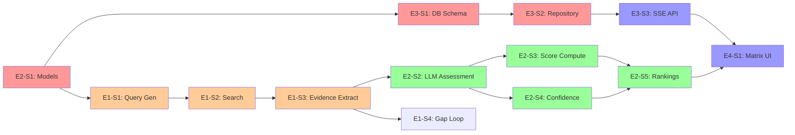

# SignalCore Plan — Final Refinement (v3)

---

## Q1: How Does the Deep Research Loop Know When It Has "Enough"?

### The Problem

"Enough evidence" is subjective. We need a **deterministic, measurable** definition that the LangGraph conditional edge can evaluate without LLM involvement (otherwise we're using AI to judge AI, which adds latency and cost).

### Definition: Evidence Sufficiency

A vendor×requirement pair has **sufficient evidence** when it meets ALL of these thresholds:

```python
def is_evidence_sufficient(evidence_items: list[Evidence]) -> bool:
    """
    Deterministic check — no LLM involved.
    Returns True if we can confidently score this pair.
    """
    
    # Threshold 1: Minimum source count
    # We need at least 2 independent sources to cross-reference
    if len(evidence_items) < 2:
        return False
    
    # Threshold 2: At least one high-authority source
    # We need at least 1 source from official docs or GitHub
    # (not just blog posts or community forums)
    high_authority = [
        e for e in evidence_items 
        if e.source_type in ("official_docs", "github")
    ]
    if len(high_authority) < 1:
        return False
    
    # Threshold 3: At least one supporting OR refuting evidence
    # We need directional signal — not just tangential mentions
    directional = [
        e for e in evidence_items 
        if e.relevance >= 0.5  # Minimum relevance threshold
    ]
    if len(directional) < 1:
        return False
    
    return True
```

### What `find_evidence_gaps` Actually Does

```python
def find_evidence_gaps(
    evidence: dict,  # {vendor: {req_id: [Evidence]}}
    vendors: list[str],
    requirements: list[dict]
) -> list[dict]:
    """
    Identify vendor×requirement pairs that need more research.
    Returns a list of gaps with context for query refinement.
    """
    gaps = []
    
    for vendor in vendors:
        for req in requirements:
            req_id = str(req["id"])
            items = evidence.get(vendor, {}).get(req_id, [])
            
            if is_evidence_sufficient(items):
                continue  # This pair is good
            
            # Diagnose WHY evidence is insufficient
            gap = {
                "vendor": vendor,
                "requirement_id": req_id,
                "requirement_text": req["text"],
                "current_count": len(items),
                "gap_type": diagnose_gap(items)
            }
            gaps.append(gap)
    
    return gaps


def diagnose_gap(items: list[Evidence]) -> str:
    """Classify the type of evidence gap to guide query refinement."""
    
    if len(items) == 0:
        return "no_evidence"          # Nothing found at all
    
    has_official = any(e.source_type in ("official_docs", "github") for e in items)
    has_relevant = any(e.relevance >= 0.5 for e in items)
    
    if not has_official:
        return "no_authoritative_source"  # Found stuff, but all low-authority
    
    if not has_relevant:
        return "low_relevance"            # Found stuff, but tangential
    
    return "insufficient_count"           # Just need one more source
```

### How Gap Type Drives Query Refinement

The gap diagnosis feeds directly into how we generate the follow-up query:

```python
REFINEMENT_STRATEGIES = {
    "no_evidence": 
        # Try completely different angle — maybe the feature 
        # has a different name for this vendor
        "Search for alternative terminology, related features, "
        "or competitor comparisons that mention {vendor}",
    
    "no_authoritative_source": 
        # We found community chatter but no official docs
        "Search specifically in official documentation: "
        "site:docs.{vendor_domain} OR site:github.com/{vendor_org}",
    
    "low_relevance": 
        # Results were about the vendor but not this requirement
        "Use more specific technical terms from the requirement. "
        "Combine {vendor} with exact feature names.",
    
    "insufficient_count": 
        # Almost there — just need one more confirming source
        "Search for third-party comparisons or reviews that "
        "discuss {vendor}'s {requirement} capability"
}
```

### The Conditional Edge in LangGraph

```python
def should_continue_research(state: ResearchState) -> str:
    """LangGraph conditional edge — decides next node."""
    
    gaps = find_evidence_gaps(
        state["evidence"], 
        state["vendors"], 
        state["requirements"]
    )
    current_iteration = state.get("iteration", 0)
    
    # Hard cap: never loop more than twice
    if current_iteration >= 2:
        # Even with gaps, we move on — log the gaps for transparency
        state["unresolved_gaps"] = gaps
        return "assess"
    
    if len(gaps) == 0:
        return "assess"  # All pairs sufficient
    
    # Store gaps in state so the refinement node can use them
    state["research_gaps"] = gaps
    state["iteration"] = current_iteration + 1
    return "refine_and_search"
```

### Why These Specific Thresholds?

| Threshold | Value | Rationale |
|-----------|-------|-----------|
| Min sources: 2 | Low bar intentionally | One source could be wrong/outdated. Two allows cross-reference. Higher would waste API calls for well-documented vendors. |
| Min 1 authoritative source | Official docs or GitHub | Blog posts and forums can be inaccurate. We need at least one source the vendor controls or contributes to. |
| Min 1 relevant (≥0.5) source | Relevance threshold | Prevents counting tangential mentions. A page about "Langfuse" that doesn't mention "OpenTelemetry" shouldn't count for that requirement. |
| Max iterations: 2 | Hard cap | Prevents infinite loops. Diminishing returns — if 2 iterations don't find evidence, a third probably won't either. The gap becomes a confidence penalty instead. |

---

## Q2: How Are Two Query Variations Generated?

### The Mechanism

The LLM generates both queries in a single call, but with explicit instructions to target different source types. Here's the concrete example for **Langfuse × Framework-agnostic tracing**:

### Prompt (with example output)

```
VENDOR: Langfuse
VENDOR DESCRIPTION: Open-source (MIT) LLM observability platform
REQUIREMENT: Framework-agnostic tracing (not locked into LangChain 
             or any single framework)
PRIORITY: High

Generate exactly 2 search queries. Each MUST target a different source type:

Query 1 — OFFICIAL SOURCES: Target the vendor's own documentation, 
  product pages, or GitHub repository. Use specific technical terms.

Query 2 — EXTERNAL SOURCES: Target third-party comparisons, community 
  discussions, blog posts, or independent reviews. Focus on real-world 
  usage experiences.
```

**Expected LLM output:**

```json
{
  "queries": [
    "Langfuse SDK integration non-LangChain frameworks documentation",
    "Langfuse framework agnostic tracing vs LangSmith comparison"
  ]
}
```

### Why Two Different Angles Matter

| Query | Target | What It Finds | Why It Matters |
|-------|--------|---------------|----------------|
| Query 1 (official) | Vendor docs, GitHub | "Langfuse supports OpenAI, Anthropic, LlamaIndex, custom SDKs..." | Factual capability — what the vendor claims |
| Query 2 (external) | Comparisons, community | "Switched from LangSmith to Langfuse because it works with our custom framework..." | Validation — what users actually experience |

Official docs tell you what a vendor **says** they support. External sources tell you what **actually works**. The gap between these two is where procurement mistakes happen — which is exactly what SignalCore's product addresses.

### More Examples Across Vendor×Requirement Pairs

| Vendor | Requirement | Query 1 (Official) | Query 2 (External) |
|--------|-------------|--------------------|--------------------|
| LangSmith | Self-hosting | `LangSmith self-hosted deployment documentation` | `LangSmith self-hosted vs cloud data sovereignty review` |
| Braintrust | Evaluation framework | `Braintrust LLM evaluation LLM-as-judge custom metrics docs` | `Braintrust evaluation framework comparison experience` |
| PostHog | OpenTelemetry | `PostHog LLM observability OpenTelemetry integration` | `PostHog OpenTelemetry support community discussion` |

### What If the LLM Generates Bad Queries?

This is a real risk. Mitigation:

1. **Structured output parsing** — If the LLM doesn't return valid JSON with exactly 2 queries, we fall back to template-based queries:
   ```python
   fallback_queries = [
       f"{vendor} {requirement_keywords} documentation",
       f"{vendor} {requirement_keywords} review comparison"
   ]
   ```

2. **Query validation** — Reject queries shorter than 3 words or longer than 12 words. Reject queries that don't contain the vendor name.

---

## Q3: Polling vs. Alternatives for Async UI Updates

### Options Analysis

| Strategy | How It Works | Complexity | Pros | Cons |
|----------|-------------|------------|------|------|
| **Polling** | UI calls `GET /job/{id}` every N seconds | Low | Simple, works everywhere, no extra deps | Wastes requests, latency = poll interval |
| **Server-Sent Events (SSE)** | Server pushes updates over persistent HTTP connection | Medium | Real-time, efficient, one-directional (perfect for us) | Needs async generator in FastAPI |
| **WebSocket** | Bidirectional persistent connection | High | Real-time, bidirectional | Overkill — we only need server→client |
| **Long polling** | Client hangs request until server has update | Medium | Fewer requests than polling | Complex error handling, timeout management |

### Recommendation: SSE for MVP

SSE (Server-Sent Events) is actually **simpler than polling** for our use case and gives a better UX. Here's why:

1. **One connection, continuous updates.** Instead of the UI making 10-20 GET requests during a 60-second pipeline run, it opens one SSE connection and receives updates as they happen.

2. **FastAPI has native support.** `StreamingResponse` with `text/event-stream` content type — no extra dependencies.

3. **Browser has native support.** `EventSource` API is built into every modern browser — no WebSocket library needed.

4. **Perfect fit for our data flow.** We only need server→client (progress updates). We never need client→server during the research run. SSE is designed exactly for this.

### Implementation

**Backend (FastAPI):**

```python
from fastapi.responses import StreamingResponse
import asyncio
import json

@app.post("/api/research")
async def start_research():
    job_id = str(uuid4())
    await store.create_job(job_id)
    # Don't use BackgroundTasks — run pipeline inside the SSE generator
    return StreamingResponse(
        research_stream(job_id),
        media_type="text/event-stream",
        headers={
            "Cache-Control": "no-cache",
            "X-Accel-Buffering": "no"  # Disable nginx buffering
        }
    )

async def research_stream(job_id: str):
    """SSE generator — runs pipeline and yields progress events."""
    
    # Event: job started
    yield f"data: {json.dumps({'type': 'started', 'job_id': job_id})}\n\n"
    
    # Run pipeline phases, yielding progress after each step
    try:
        # Phase 1: Research
        yield f"data: {json.dumps({'type': 'progress', 'phase': 'research', 'pct': 10, 'message': 'Generating search queries...'})}\n\n"
        
        queries = await generate_queries(state)
        yield f"data: {json.dumps({'type': 'progress', 'phase': 'research', 'pct': 20, 'message': f'Searching {len(queries)} queries...'})}\n\n"
        
        results = await execute_searches(queries)
        yield f"data: {json.dumps({'type': 'progress', 'phase': 'research', 'pct': 40, 'message': 'Extracting evidence...'})}\n\n"
        
        evidence = await extract_evidence(results)
        await store.save_evidence(job_id, evidence)
        
        # Phase 1b: Gap filling (if needed)
        gaps = find_evidence_gaps(evidence, vendors, requirements)
        if gaps:
            yield f"data: {json.dumps({'type': 'progress', 'phase': 'research', 'pct': 50, 'message': f'Filling {len(gaps)} evidence gaps...'})}\n\n"
            refined = await refine_and_search(gaps)
            evidence = merge_evidence(evidence, refined)
            await store.save_evidence(job_id, evidence)
        
        yield f"data: {json.dumps({'type': 'progress', 'phase': 'research', 'pct': 60, 'message': 'Research complete'})}\n\n"
        
        # Phase 2: Scoring
        yield f"data: {json.dumps({'type': 'progress', 'phase': 'scoring', 'pct': 65, 'message': 'Assessing capabilities...'})}\n\n"
        
        assessments = await assess_capabilities(evidence)
        scores = compute_scores(assessments, evidence)
        await store.save_scores(job_id, scores)
        
        yield f"data: {json.dumps({'type': 'progress', 'phase': 'scoring', 'pct': 85, 'message': 'Computing rankings...'})}\n\n"
        
        rankings = compute_overall_rankings(scores, requirements)
        
        # Phase 3: Synthesis
        yield f"data: {json.dumps({'type': 'progress', 'phase': 'synthesis', 'pct': 90, 'message': 'Generating summary...'})}\n\n"
        
        summary = await generate_summary(rankings, scores, evidence)
        await store.complete_job(job_id, summary, rankings)
        
        # Final event: complete results
        results = await store.get_results(job_id)
        yield f"data: {json.dumps({'type': 'completed', 'results': results})}\n\n"
    
    except Exception as e:
        await store.fail_job(job_id, str(e))
        yield f"data: {json.dumps({'type': 'error', 'message': str(e)})}\n\n"
```

**Frontend (vanilla JS):**

```javascript
function startResearch() {
    const eventSource = new EventSource('/api/research', {
        // Note: EventSource only supports GET by default.
        // For POST, we use fetch + ReadableStream instead (see below)
    });
    // ...
}

// Since EventSource doesn't support POST, use fetch with streaming:
async function startResearch() {
    const response = await fetch('/api/research', { method: 'POST' });
    const reader = response.body.getReader();
    const decoder = new TextDecoder();
    
    while (true) {
        const { done, value } = await reader.read();
        if (done) break;
        
        const text = decoder.decode(value);
        const lines = text.split('\n');
        
        for (const line of lines) {
            if (line.startsWith('data: ')) {
                const event = JSON.parse(line.slice(6));
                handleEvent(event);
            }
        }
    }
}

function handleEvent(event) {
    switch (event.type) {
        case 'progress':
            updateProgressBar(event.pct);
            updateStatusMessage(event.message);
            break;
        case 'completed':
            renderResults(event.results);
            break;
        case 'error':
            showError(event.message);
            break;
    }
}
```

### Why This Is Better Than Polling for Our Case

| Aspect | Polling (every 3s) | SSE Streaming |
|--------|-------------------|---------------|
| Requests during 60s pipeline | ~20 GET requests | 1 persistent connection |
| Update latency | Up to 3s delay | Instant (as events fire) |
| Progress granularity | Only when polled | Every step of the pipeline |
| Implementation complexity | POST + GET + setInterval | POST with StreamingResponse |
| Error handling | Must handle GET failures | Connection error event |
| SQLite reads | 20 reads during pipeline | 0 reads during pipeline (data flows in memory) |

**Important nuance:** We still persist to SQLite during the stream (so completed results survive a page refresh), but the UI gets live updates through the stream rather than polling the DB.

### Keeping the GET Endpoint (For Cached Results)

```python
# GET still exists — for viewing previously completed jobs
@app.get("/api/research/{job_id}")
async def get_research_results(job_id: str):
    """Retrieve results of a previously completed research job."""
    job = await store.get_job(job_id)
    if not job:
        raise HTTPException(404, "Job not found")
    if job["status"] != "completed":
        raise HTTPException(400, "Job not yet completed")
    return await store.get_results(job_id)

# GET /api/jobs — List all previous jobs
@app.get("/api/jobs")
async def list_jobs():
    return await store.list_jobs()
```

---

## Q4: Why Models + Repository Pattern Instead of Raw SQL?

You're absolutely right. Using proper models and a repository pattern is better even for a prototype because:

1. **Type safety** — Pydantic models catch data shape errors at the boundary, not in SQL
2. **Testability** — Repository interface can be mocked for unit tests
3. **Clean separation** — Business logic never touches SQL directly
4. **Scalability narrative** — In the Zoom, you can say "swapping SQLite for PostgreSQL means changing one file: the repository implementation"

### Models (Pydantic)

```python
# app/models.py
from pydantic import BaseModel, Field
from datetime import datetime
from enum import Enum

# --- Enums ---

class JobStatus(str, Enum):
    RUNNING = "running"
    COMPLETED = "completed"
    FAILED = "failed"

class SourceType(str, Enum):
    OFFICIAL_DOCS = "official_docs"
    GITHUB = "github"
    COMPARISON = "comparison"
    BLOG = "blog"
    COMMUNITY = "community"

class CapabilityLevel(str, Enum):
    FULL = "full"
    PARTIAL = "partial"
    MINIMAL = "minimal"
    NONE = "none"
    UNKNOWN = "unknown"

class Maturity(str, Enum):
    GA = "ga"
    BETA = "beta"
    EXPERIMENTAL = "experimental"
    PLANNED = "planned"
    UNKNOWN = "unknown"

class Priority(str, Enum):
    HIGH = "high"
    MEDIUM = "medium"
    LOW = "low"

# --- Domain Models ---

class Requirement(BaseModel):
    id: int
    text: str
    priority: Priority
    weight: float  # high=3.0, medium=2.0, low=1.0

class Evidence(BaseModel):
    claim: str
    source_url: str
    source_name: str
    source_type: SourceType
    content_date: str | None = None
    relevance: float = Field(ge=0.0, le=1.0)
    supports_requirement: bool

class LLMAssessment(BaseModel):
    capability_level: CapabilityLevel
    capability_details: str
    maturity: Maturity
    limitations: list[str] = []
    supports_requirement: bool

class ScoreResult(BaseModel):
    score: float = Field(ge=0.0, le=10.0)
    confidence: float = Field(ge=0.0, le=1.0)
    capability_level: CapabilityLevel
    maturity: Maturity
    justification: str
    limitations: list[str] = []
    evidence: list[Evidence] = []

class VendorRanking(BaseModel):
    vendor: str
    weighted_score: float  # 0-100
    avg_confidence: float  # 0-1

class ResearchJob(BaseModel):
    id: str
    status: JobStatus
    created_at: datetime
    completed_at: datetime | None = None
    progress_pct: int = 0
    progress_message: str = ""

class ResearchResults(BaseModel):
    job: ResearchJob
    vendors: list[str]
    requirements: list[Requirement]
    matrix: dict[str, dict[str, ScoreResult]]   # vendor -> req_id -> score
    rankings: list[VendorRanking]
    summary: str
```

### Repository Interface + Implementation

```python
# app/repository.py
from abc import ABC, abstractmethod

class ResearchRepository(ABC):
    """Abstract interface — business logic depends on this, not SQLite."""
    
    @abstractmethod
    async def create_job(self, job_id: str) -> None: ...
    
    @abstractmethod
    async def update_progress(self, job_id: str, pct: int, message: str) -> None: ...
    
    @abstractmethod
    async def save_evidence(
        self, job_id: str, vendor: str, req_id: str, evidence: list[Evidence]
    ) -> None: ...
    
    @abstractmethod
    async def save_score(
        self, job_id: str, vendor: str, req_id: str, score: ScoreResult
    ) -> None: ...
    
    @abstractmethod
    async def complete_job(
        self, job_id: str, summary: str, rankings: list[VendorRanking]
    ) -> None: ...
    
    @abstractmethod
    async def fail_job(self, job_id: str, error: str) -> None: ...
    
    @abstractmethod
    async def get_job(self, job_id: str) -> ResearchJob | None: ...
    
    @abstractmethod
    async def get_results(self, job_id: str) -> ResearchResults | None: ...
    
    @abstractmethod
    async def list_jobs(self) -> list[ResearchJob]: ...


class SQLiteResearchRepository(ResearchRepository):
    """SQLite implementation — swap for PostgresRepository at scale."""
    
    def __init__(self, db_path: str = "research.db"):
        self.db_path = db_path
    
    async def initialize(self):
        """Create tables if they don't exist."""
        async with aiosqlite.connect(self.db_path) as db:
            await db.executescript(SCHEMA_SQL)
    
    async def create_job(self, job_id: str) -> None:
        async with aiosqlite.connect(self.db_path) as db:
            await db.execute(
                "INSERT INTO jobs (id, status) VALUES (?, ?)",
                (job_id, JobStatus.RUNNING.value)
            )
            await db.commit()
    
    async def save_evidence(
        self, job_id: str, vendor: str, req_id: str, evidence: list[Evidence]
    ) -> None:
        async with aiosqlite.connect(self.db_path) as db:
            for e in evidence:
                await db.execute(
                    """INSERT INTO evidence 
                       (job_id, vendor, requirement_id, claim, source_url, 
                        source_name, source_type, content_date, relevance, 
                        supports_requirement)
                       VALUES (?, ?, ?, ?, ?, ?, ?, ?, ?, ?)""",
                    (job_id, vendor, req_id, e.claim, e.source_url,
                     e.source_name, e.source_type.value, e.content_date,
                     e.relevance, e.supports_requirement)
                )
            await db.commit()
    
    # ... remaining methods follow the same pattern
```

### Dependency Injection in FastAPI

```python
# app/main.py
from app.repository import SQLiteResearchRepository, ResearchRepository

# Create repository instance
repo = SQLiteResearchRepository("research.db")

@app.on_event("startup")
async def startup():
    await repo.initialize()

# Inject into endpoints
@app.post("/api/research")
async def start_research():
    job_id = str(uuid4())
    await repo.create_job(job_id)
    return StreamingResponse(
        research_stream(job_id, repo),  # Pass repo to pipeline
        media_type="text/event-stream"
    )
```

### The Zoom Talking Point

> "The repository pattern means SQLite is an implementation detail, not an architectural commitment. The pipeline and API depend on `ResearchRepository` — an abstract interface. To move to PostgreSQL, I'd write `PostgresResearchRepository` implementing the same interface. No business logic changes."

---

## Updated MoSCoW — Final Version

### Must Have (Non-negotiable for prototype)

| ID | Feature | Effort | Acceptance Criteria |
|----|---------|--------|---------------------|
| M-01 | **LangGraph research pipeline** with deep research loop (2-iteration max) | 45 min | Generates queries, searches Tavily, extracts evidence, fills gaps for insufficient pairs |
| M-02 | **Structured evidence extraction** via LLM with typed output | 20 min | Every evidence item has claim, source_url, source_type, content_date, relevance, supports_requirement |
| M-03 | **Deterministic scoring engine** (score 0-10 + confidence 0-1) | 20 min | Scores computed algorithmically from evidence attributes; same inputs = same outputs |
| M-04 | **FastAPI with SSE streaming** (POST streams progress, GET for cached results) | 20 min | POST /api/research streams events; GET /api/research/{id} returns completed results; GET /api/jobs lists history |
| M-05 | **Results UI — comparison matrix** | 10 min | Table: vendors as columns, requirements as rows, scores + confidence in cells |
| M-06 | **SQLite persistence** with repository pattern | 15 min | Jobs, evidence, and scores persisted; results survive page refresh |
| M-07 | **Pydantic domain models** | 10 min | Evidence, ScoreResult, LLMAssessment, VendorRanking, ResearchJob — all typed |

**Must-Have subtotal: ~140 min (78% of 180 min)** ⚠️ Over 60% rule.

**Mitigation:** M-07 (models) is written once and reused everywhere — it actually *saves* time by preventing debugging malformed dicts. The real risk items are M-01 (pipeline) and M-04 (SSE), which are the two most complex pieces. If time runs short, M-05 (UI) can be simplified to a raw JSON page that still demonstrates the data.

### Should Have (Important, cut if behind)

| ID | Feature | Effort | Acceptance Criteria |
|----|---------|--------|---------------------|
| S-01 | **Confidence visualization** in UI | 10 min | Cell background opacity or border style reflects confidence level |
| S-02 | **Evidence drill-down panel** | 15 min | Click a cell → see source list with URLs, dates, claims |
| S-03 | **Executive summary** (LLM-generated) | 10 min | 3-4 paragraph summary at top of results page |

**Should-Have subtotal: ~35 min**

### Could Have (Nice-to-have, drop first)

| ID | Feature | Effort | Notes |
|----|---------|--------|-------|
| C-01 | **Progress bar in UI** with phase labels | 5 min | Visual progress from SSE events |
| C-02 | **Job history page** (list + re-view past results) | 10 min | GET /api/jobs + simple list UI |
| C-03 | **UI styling polish** | 10 min | CSS cleanup, responsive layout, hover states |
| C-04 | **Export to markdown** | 10 min | Download comparison report as .md file |

**Could-Have subtotal: ~35 min**

### Won't Have (Explicitly excluded)

| ID | Feature | Rationale |
|----|---------|-----------|
| W-01 | User-defined vendors/requirements | Fixed for prototype; trivial to parameterize later |
| W-02 | Automated vendor software testing | SignalCore's differentiator, but out of scope for assignment |
| W-03 | Authentication / multi-user | Single-user prototype |
| W-04 | Multi-provider search (Tavily + Exa + SerpAPI) | Tavily alone for MVP; document multi-provider as scale strategy |
| W-05 | Vector store for evidence search | In-memory + SQLite sufficient; document for scale |
| W-06 | Tavily `/research` endpoint integration | We build our own research loop; document as future enrichment |

### Scope Summary

| Priority | Count | Effort | % of Total |
|----------|-------|--------|------------|
| Must Have | 7 | 140 min | 67% |
| Should Have | 3 | 35 min | 17% |
| Could Have | 4 | 35 min | 16% |
| **Total** | **14** | **210 min** | 100% |

**Buffer note:** Total exceeds 180 min by 30 min. This is intentional — Could-Have items are the buffer. If everything in Must-Have takes exactly as estimated, we get all Should-Haves and some Could-Haves. If Must-Have runs 20% over, we still deliver all Must-Haves and drop some Should-Haves. The math works.

---

## PM Handoff — PRD, Epics & Stories

### Product Requirements Document (PRD) Summary

**Product:** Vendor Research Tool (SignalCore Engineering Evaluation)
**Goal:** Build a prototype that researches LLM observability vendors against defined requirements, scores them transparently, and presents actionable comparison results.
**Users:** Technical evaluator (single user, reviewer role)
**Success metrics:** Functional prototype that runs locally, demonstrates real web research (not static LLM knowledge), transparent scoring with citations, and drillable UI.

### Epic Structure

```
EPIC 1: Research Pipeline           ← The engine (M-01, M-02)
EPIC 2: Scoring Engine              ← The brain (M-03, M-07)
EPIC 3: API & Persistence Layer     ← The backbone (M-04, M-06)
EPIC 4: Results UI                  ← The face (M-05, S-01, S-02, S-03)
EPIC 5: Polish & Delivery           ← The finish (C-01 through C-04)
```

### Epic 1: Research Pipeline

**Goal:** Given a list of vendors and requirements, automatically collect cited evidence from the web for each vendor×requirement pair.

| Story ID | Story | Points | Acceptance Criteria |
|----------|-------|--------|---------------------|
| E1-S1 | As the pipeline, I generate 2 targeted search queries per vendor×requirement pair so that we search from multiple angles | 3 | LLM produces 2 queries per pair; one targets official sources, one targets external sources; queries contain vendor name; fallback templates if LLM output is invalid |
| E1-S2 | As the pipeline, I execute Tavily searches in parallel so that research completes in under 60 seconds | 5 | All queries execute via asyncio with semaphore (max 5 concurrent); each query uses `search_depth: basic`, `max_results: 5`, `time_range: year`; results stored in state |
| E1-S3 | As the pipeline, I extract structured evidence from search results so that every claim is traceable to a source | 5 | LLM extracts Evidence objects with all required fields; only claims explicitly stated in sources; relevance >= 0.3 threshold for inclusion |
| E1-S4 | As the pipeline, I evaluate evidence sufficiency and fill gaps so that sparse-evidence pairs get extra research | 3 | `is_evidence_sufficient()` checks min 2 sources, min 1 authoritative, min 1 relevant; gaps trigger refined queries; max 2 iterations total |
| E1-S5 | As the pipeline, I emit SSE progress events so that the UI can show real-time status | 2 | Events emitted at: query generation, search execution, evidence extraction, gap filling, each scoring phase, completion |

**Epic 1 total: 18 points**

### Epic 2: Scoring Engine

**Goal:** Compute transparent, deterministic scores from evidence with separate capability and confidence dimensions.

| Story ID | Story | Points | Acceptance Criteria |
|----------|-------|--------|---------------------|
| E2-S1 | As the scoring engine, I define domain models (Evidence, ScoreResult, LLMAssessment, etc.) so that data flows through typed structures | 2 | All Pydantic models defined with field validation (ge/le constraints, enums); models serialize to/from JSON cleanly |
| E2-S2 | As the scoring engine, I get LLM capability assessments per vendor×requirement so that I have structured input for scoring | 3 | LLM returns LLMAssessment (capability_level, maturity, limitations); conservative prompt prevents overstatement; "unknown" used when evidence is ambiguous |
| E2-S3 | As the scoring engine, I compute requirement scores (0-10) deterministically from assessment + evidence so that same inputs always produce same scores | 3 | Score = weighted combination of capability (40%), evidence strength (30%), maturity (20%), limitations penalty (10%); no LLM involvement in computation |
| E2-S4 | As the scoring engine, I compute confidence scores (0-1) from evidence metadata so that users know how much to trust each score | 2 | Confidence = weighted combination of source count (30%), authority (30%), recency (25%), consistency (15%); fully deterministic, no LLM |
| E2-S5 | As the scoring engine, I compute weighted overall rankings so that vendors are ranked by priority-adjusted scores | 2 | Weighted score = Σ(score × priority_weight × confidence); normalized to 0-100; rankings sorted descending |

**Epic 2 total: 12 points**

### Epic 3: API & Persistence Layer

**Goal:** Provide REST endpoints for triggering research and retrieving results, with SQLite persistence for durability.

| Story ID | Story | Points | Acceptance Criteria |
|----------|-------|--------|---------------------|
| E3-S1 | As the persistence layer, I initialize SQLite schema on startup so that data is stored durably | 2 | Tables: jobs, evidence, scores; created on app startup; indexes on job_id foreign keys |
| E3-S2 | As the persistence layer, I implement ResearchRepository with SQLite so that all data access goes through a typed interface | 3 | Abstract base class + SQLite implementation; all methods async (aiosqlite); models in, models out |
| E3-S3 | As the API, I expose POST /api/research that returns SSE stream so that the UI gets real-time updates | 3 | Returns StreamingResponse with text/event-stream; events are JSON with type field; pipeline runs inside generator |
| E3-S4 | As the API, I expose GET /api/research/{job_id} so that completed results can be retrieved after the fact | 2 | Returns full ResearchResults for completed jobs; 404 for unknown jobs; 400 for non-completed jobs |
| E3-S5 | As the API, I expose GET /api/jobs so that users can see previous research runs | 1 | Returns list of ResearchJob objects sorted by created_at desc |
| E3-S6 | As the API, I serve static frontend files so that the app runs as a single process | 1 | FastAPI StaticFiles mount serves index.html from /static |

**Epic 3 total: 12 points**

### Epic 4: Results UI

**Goal:** Present comparison results in a usable interface that shows scores, confidence, evidence, and overall rankings.

| Story ID | Story | Points | Acceptance Criteria |
|----------|-------|--------|---------------------|
| E4-S1 | As a reviewer, I see a comparison matrix (vendors × requirements) so that I can compare at a glance | 3 | HTML table with vendor columns, requirement rows; cells show score (0-10) and confidence indicator; requirements grouped by priority (High first) |
| E4-S2 | As a reviewer, I see confidence reflected visually so that I know which scores to trust | 2 | High confidence (>0.7): solid cell, full color. Medium (0.4-0.7): lighter color. Low (<0.4): dashed border, muted, tooltip warning |
| E4-S3 | As a reviewer, I can drill into a cell to see evidence so that I understand why a score was given | 3 | Click cell → expand panel showing: justification text, list of evidence items with clickable source URLs, source type badges, content dates |
| E4-S4 | As a reviewer, I see an executive summary so that I get a quick recommendation | 2 | Summary displayed above the matrix; 3-4 paragraphs; generated by LLM from rankings and evidence |
| E4-S5 | As a reviewer, I see live progress during research so that I know the system is working | 2 | Progress bar with percentage; status message updates per SSE events; phases labeled (Research → Scoring → Summary) |

**Epic 4 total: 12 points**

### Epic 5: Polish & Delivery

**Goal:** Package the prototype for review with documentation and professional finish.

| Story ID | Story | Points | Acceptance Criteria |
|----------|-------|--------|---------------------|
| E5-S1 | As a reviewer, I can clone the repo and run the app with 3 commands so that setup is frictionless | 2 | README with: prerequisites, `pip install`, env setup, `uvicorn` command; tested on clean environment |
| E5-S2 | As a reviewer, I see a polished UI so that the prototype feels professional | 2 | Clean CSS, consistent spacing, responsive layout, hover states on interactive elements |
| E5-S3 | As a reviewer, I can read a write-up of approach and decisions so that I understand the thinking | 2 | README covers: architecture choices, scoring methodology, AI usage log, what I'd improve with more time |
| E5-S4 | As a reviewer, I can view past research jobs so that I don't need to re-run to see results | 1 | Job history page with list of completed jobs; click to view results |

**Epic 5 total: 7 points**

### Story Map (Priority × Epic)

```
                    EPIC 1          EPIC 2          EPIC 3          EPIC 4         EPIC 5
                    Research        Scoring         API/Data        UI             Delivery
                    Pipeline        Engine          Layer
─────────────────────────────────────────────────────────────────────────────────────────────
MUST HAVE           E1-S1           E2-S1           E3-S1           E4-S1          E5-S1
(Sprint 1)          E1-S2           E2-S2           E3-S2           
                    E1-S3           E2-S3           E3-S3           
                    E1-S4           E2-S4           E3-S6           
                                    E2-S5                           
─────────────────────────────────────────────────────────────────────────────────────────────
SHOULD HAVE         E1-S5                           E3-S4           E4-S2          E5-S3
(Sprint 1                                                           E4-S3          
 if time)                                                           E4-S4          
─────────────────────────────────────────────────────────────────────────────────────────────
COULD HAVE                                          E3-S5           E4-S5          E5-S2
(Stretch)                                                                          E5-S4
─────────────────────────────────────────────────────────────────────────────────────────────
```

### Suggested Build Order (Critical Path)

```
1. E2-S1 (Models)              ← Everything depends on typed models
2. E3-S1 + E3-S2 (DB + Repo)  ← Pipeline needs somewhere to write
3. E1-S1 + E1-S2 (Queries + Search)  ← Core research loop
4. E1-S3 (Evidence extraction)  ← Makes search results usable
5. E2-S2 + E2-S3 + E2-S4 (Scoring) ← Turns evidence into scores
6. E2-S5 (Rankings)            ← Aggregates scores
7. E3-S3 + E3-S6 (API + Static) ← Exposes pipeline to browser
8. E4-S1 (Matrix UI)           ← Minimum viable display
9. E1-S4 (Gap filling loop)    ← Deep research enhancement
── MUST HAVE COMPLETE ──
10. E4-S2 + E4-S3 (Confidence viz + Drill-down)
11. E4-S4 (Summary)
12. E3-S4 (GET cached results)
── SHOULD HAVE COMPLETE ──
13. E1-S5 + E4-S5 (SSE progress in UI)
14. E5-S1 + E5-S3 (README + Write-up)
── DELIVERABLE READY ──
```

### Key Dependencies


